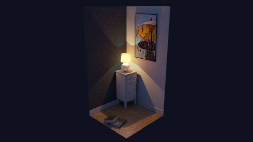
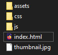
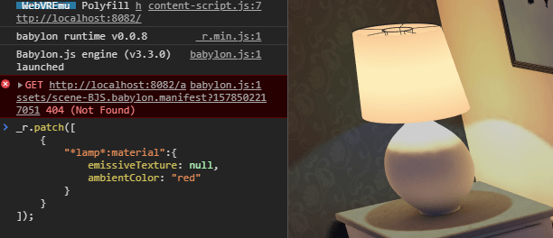

# Using \_runtime in an existing scene

We will take as example a scene that you maybe already seen, the one I've made for a tutorial about Blender to BabylonJS, including lightmaps management: [From Blender to BabylonJS workflow](https://nothing-is-3d.com/data/medias/folio/3drealtime/lightmaps-workflow-tutorial/demo.html).



> notice this scene is in standard workflow, not PBR

[Download link](https://www.nothing-is-3d.com/article27/from-blender-to-babylonjs#tocWorkflowFewWords) is available in the tutorial. Once unzip, delete all html in the root of `/BJS/` folder except `tuto-final.html`, then rename this particular file into `index.html`, and we're ready to go.



Also, don't forget to point a [local webserver](https://www.nothing-is-3d.com/article28/use-a-local-webserver) into this `/BJS/` folder. Notice that this scene was made on BJS [v3.3.0](https://github.com/BabylonJS/Babylon.js/tree/master/dist/previous%20releases/3.3) and Blender [2.79](https://download.blender.org/release/Blender2.79/) (with the now [deprecated](https://github.com/BabylonJS/BlenderExporter/tree/master/deprecated) .babylon exporter v5.6).

Of course, we'll also need to get the [last version of \_runtime](https://github.com/babylon-runtime/_r/releases/latest). Place the `_r.min.js` from the zip (located in the `/dist/` folder) into our `/js/` folder, and link the script in `index.html` below pep (line 8).

```javascript
<script src="js/babylon.js"></script>
<script src="js/pep.min.js"></script>
<script src="js/_r.min.js"></script>
```

> this time, ready to go for real!

## Patch...works!

At this time, which is not even yet the beginning, you already be able to use \_runtime! In your browser console, try to copy-paste this command line:

```javascript
_r.patch([
    {
        "*lamp*:material":{
            emissiveTexture: null,
            ambientColor: "red"
        }
    }
]);
```

If you've already took a look on [the documentation](https://babylon-runtime.github.io/), you probably guess the result this patch give us:



> Patch patching. (just reload the page to cancel)

Notice that in this exercice we will do a full convertion of our scene, which is already tweaked and finalized, but in other existing projects you can just keep them as they are and just call \_runtime when needed.

Example, inside our `SceneLoader.Append` line 129:

```javascript
var books01 = scene.getMaterialByName("scene_BJS.books01.000");
books01.invertNormalMapX = true;

_r.patch([{
    "*lamp*:material": {
        emissiveTexture: null,
        ambientColor: "red"
    }
}]);
```

> This will give the exact same result as we got when using the command line into the browser console. (don't forget to remove this \_r.patch before continuing this tutorial)

So, let's start to convert the easiest part: mesh & material tweaking (line 100 to 130). We just have to use the string part of `scene.getMaterialByName("scene_BJS.lampFabric01.000")` as a \_runtime selector `{"scene_BJS.lampFabric01.000":{ }}`.

Here I like to use the `*` char, to ease the patch reading: `{"*lampFabric01.*":{ }}`. This `*` will already allow some versatility in our workflow:

- the old .babylon exporter was adding a prefix using exported file name to the materials, using the `*` as suffix on the \_r selector, we don't care any more what exporter you're using (names can be `scene_BJS.lampFabric` or `lampFabric`, they both will be taken into account).
- the `.000` suffix can be instantly broke on Blender if the cgartist make a material duplication (turning into `.001`). Again, the `*` as suffix don't pay attention any longer to this part

Now the properties. `.diffuseColor = BABYLON.Color3.Black();` will become `diffuseColor : "black",`.

Try to convert all the tweaks inside a `_r.patch`, pay attention to `,`!

Below the result:

```javascript
/** END OF LIGHTMAP ASSIGNATION PROCESS **/

_r.patch([

    /* mesh tweaking */

    {
        "_collisions": {
            isVisible: false,
        }
    },

    /* material tweaking */

    {
        "*lampFabric01.*": {
            diffuseColor: "black",
            ambientColor: "black",
            emissiveColor: [0.47, 0.28, 0.07], // in combination with emissiveTexture
            useEmissiveAsIllumination: true, // we want light to burn
        }
    },
    {
        "*lampBulb01.*": {
            emissiveColor: "#ffffff",
        }
    },
    {
        "*lampMetal01.*": {
            diffuseColor: "black",
            ambientColor: "#222222",
            specularColor: [0.88, 0.59, 0.41],
            specularPower: 80,
        }
    },
    {
        "*holdout.*": {
            disableLighting: true,
        }
    }, {
        "*floor01.*, *books01.*": {
            invertNormalMapX: true,
        }
    },
]);

/* tools */
```

Notice that \_r allow you to place comments inside patches.

And why not put this in a dedicated file, for clarity? We can create a `/patches/` folder inside `/assets/` and name our patch file as we want (except the extension), here `tweaks.patch`:

```javascript
/** END OF LIGHTMAP ASSIGNATION PROCESS **/

_r.patch(["assets/patches/tweaks.patch"]);

/* tools */
```

> Better.

Actually, we can also patch our camera using a camera.patch for example.

line 37:

```javascript
var arcRotCam = new BABYLON.ArcRotateCamera("arcRotateCamera", 1, 1, 1, BABYLON.Vector3.Zero(), scene);
arcRotCam.attachControl(canvas, true);
```

line 82:

```javascript
/** END OF LIGHTMAP ASSIGNATION PROCESS **/

_r.patch([
    "assets/patches/tweaks.patch",
    "assets/patches/cameras.patch",
]);

/* tools */
```

cameras.patch:

```javascript
[{
    "arcRotateCamera": {
        alpha: 5.5,
        beta: 1.2,
        radius: 3.75,
        target: {
            x: -0.8,
            y: 0.75,
            z: 0.8
        },
        wheelPrecision: 200,
        pinchPrecision: 100,
        minZ: 0.005,
        panningSensibility: 2000,
        allowUpsideDown: false,
        checkCollisions: true,
        collisionRadius: [0.1, 0.1, 0.1],
        lowerAlphaLimit: 4.5,
        upperAlphaLimit: 6.5,
        lowerBetaLimit: 0,
        upperBetaLimit: 1.8,
        upperRadiusLimit: 7,
    }
}]
```
And, let's be crazy, also our scene:

scene.patch:
```javascript
[{
    "scene": {
        clearColor: "#10111e",
        ambientColor: "white",
    }
}]
```


## Simplify the loading

We're just going to get rid of the most of the code, using `_r.launch()`. The only code inside `<body>` tag that we'll keep untouched - for now - will be the lightmap assignation processing.

As even the canvas and engine renderloop can be handled by \_runtime, steps will be:

- delete `<canvas>` tags
- delete all engine and scene creation
- replace `SceneLoader.Append()` with `_r.launch()`
- use `_r.ready()` to be able to use our lightmap javascript

Note that it's also possible to keep using your canvas or engine, in case you want custom [EngineOptions](https://doc.babylonjs.com/api/classes/babylon.engine#constructor) for example.

As we're not using a camera stored into the .babylon, but created from scratch, we need to include its creation inside our cameras.patch, then make it current activeCamera in our `_r.ready()`.

To do that, we'll use the "execute" patch functionnality before camera patch properties we've already made:

```javascript
[{
        "exec": function () {
            // we can do the code we want here,
            // but be sure to "return" the camera object
            return new BABYLON.ArcRotateCamera(
                "arcRotateCamera",
                1, 1, 1, BABYLON.Vector3.Zero(),
                _r.scene);
        }
    },
    {
        "arcRotateCamera": {
            alpha: 5.5,
            beta: 1.2,
            [...]
```

> camera is created, then patched

So here the new structure:

```javascript
<!doctype html>
<html>

<head>
    <title>Converting a raw BJS scene to _runtime</title>
    <meta charset="UTF-8">
    <script src="js/babylon.js"></script>
    <script src="js/pep.min.js"></script>
    <script src="js/_r.min.js"></script>
    <style>
        html,
        body {
            overflow: hidden;
            width: 100%;
            height: 100%;
            margin: 0;
            padding: 0;
            font-family: tahoma, arial, sans-serif;
            color: white;
        }
    </style>
</head>

<body>
    <script type="text/javascript">
        _r.launch({
            scene: "assets/scene-BJS.babylon",
            patch: [
                "assets/patches/scene.patch",
                "assets/patches/cameras.patch",
                "assets/patches/tweaks.patch",
            ]
        });

        _r.ready(function () {

            _r.activateCamera("arcRotateCamera");

            /** LIGHTMAP ASSIGNATION PROCESS **/
            [...]
        });
    </script>
</body>

</html>
```

Notice the loss of `#canvas` css which is now useless (\_runtime automatically create a canvas with these parameters).

## Get our hands dirty

Time to see how to deal with lightmaps.

In my original tutorial, my javascript code was as simple as possible, for people able to understand it as much as possible. But this had the inconvenient to assign the texture file even if it was still not downloaded! In raw javascript we need to play with the [onLoad](https://doc.babylonjs.com/api/classes/babylon.texture#constructor) callback, but this is tricky to explain and understand when you're not a dev ([here a playground](https://www.babylonjs-playground.com/#4AJ16M#15) using this callback).

\_runtime will here be useful for us by:

- loading and creating the lightmap texture
- patching our targets materials and assigning them the right lightmap

*(clone materials, texture creation, looping inside materials inside our meshes selector)*

## Adding few features

- *custom loading screen*